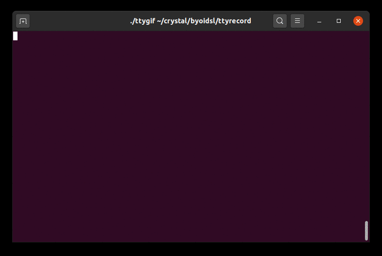

# byoidsl

This repository is a companion to a live-coding project aimed at building your own interactive DSL.

You can check out the videos [here](https://www.youtube.com/playlist?list=PLfpFq_WLOW__7nB9z2CFUWZhzRM3oSBGM).



## Installation

Clone the project, then run `shards install` to install the dependencies.

To package the CLI tool into an executable, run
```
crystal build --release src/igol_repl.cr -o igol
```

## Using the CLI tool

You can use the CLI tool to either start the REPL or run a script.

Run `./igol --help` to print the CLI help message.

### REPL
To enter the REPL, you can run
```
crystal src/igol_cli.cr
```

or simply

```
./igol
```

The REPL can interpret commands to
* show the current state of the grid
* evolve the grid
* assign a pattern to a variable
* set a pattern on the grid

The REPL also supports loading scripts from a file into the REPL runtime,
with the special `%load` syntax
```
%load filepath/to/script 
```

Try running the following yourself!

```
(0,2) <- .****
show
%load examples/script.igol
evolve 2;
n: ..*
(1,-2) <- n
```

*Note.* You can append `;` to a DSL instruction to suppress the output.

### Running scripts
To run a script, simply pass an argument to the executable, e.g.
```
./igol examples/script.igol
```

## Contributing

1. Fork it (<https://github.com/lbarasti/byoidsl/fork>)
2. Create your feature branch (`git checkout -b my-new-feature`)
3. Commit your changes (`git commit -am 'Add some feature'`)
4. Push to the branch (`git push origin my-new-feature`)
5. Create a new Pull Request

## Contributors

- [lbarasti](https://github.com/lbarasti) - creator and maintainer
